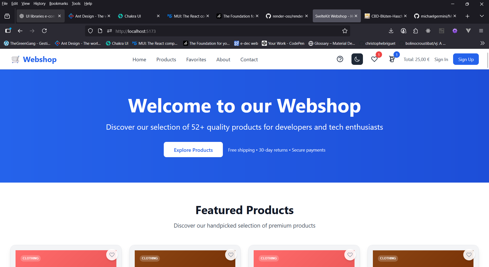
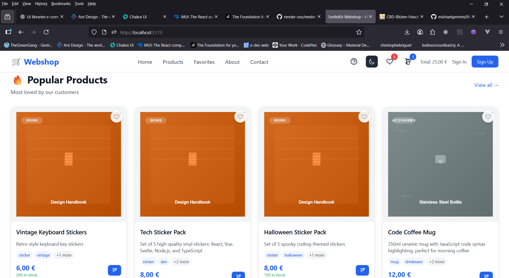
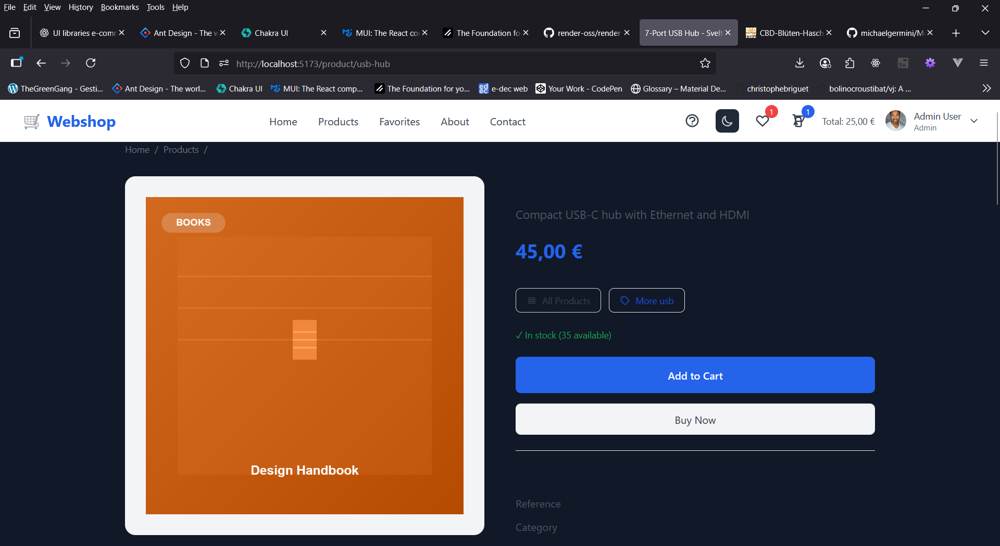
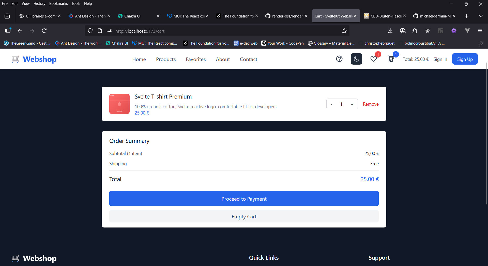
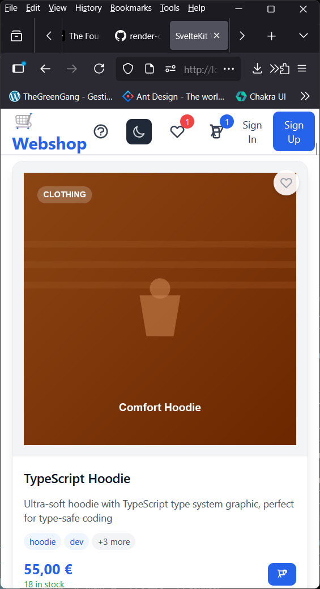
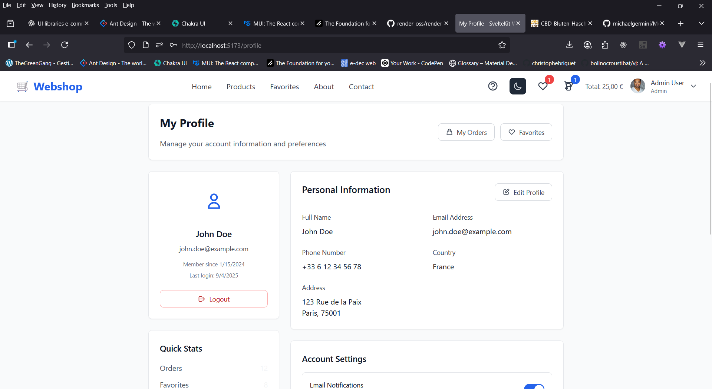
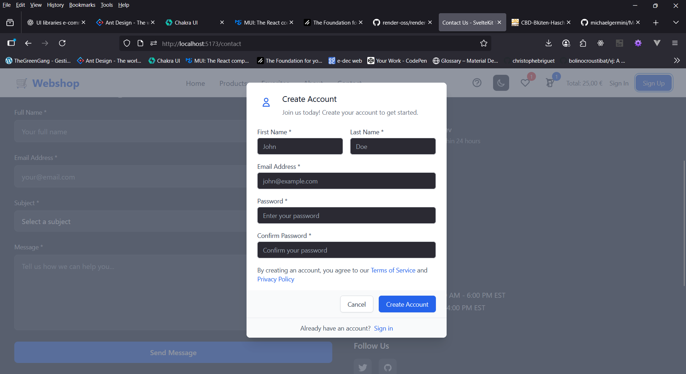
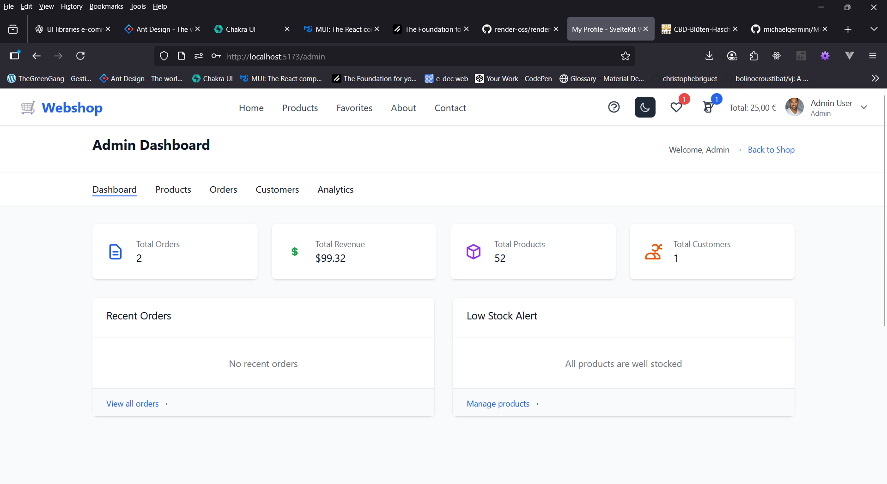
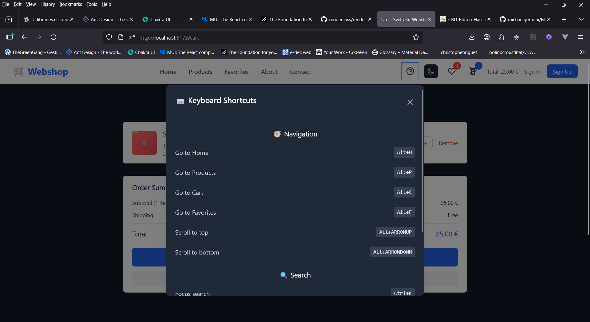
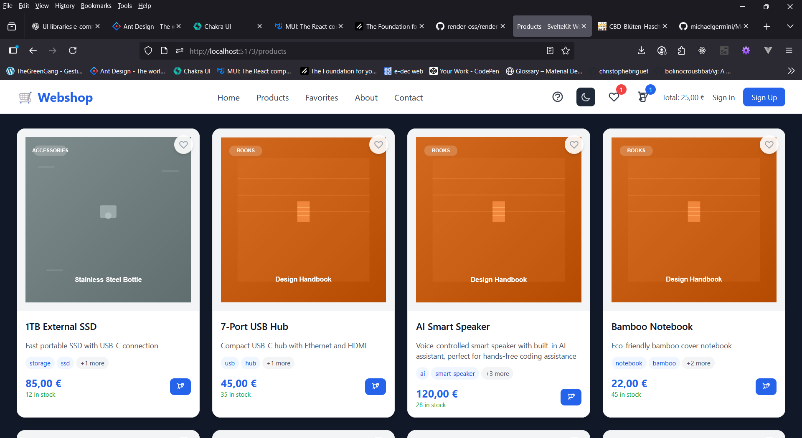

# 🛒 Modern SvelteKit E-Commerce Webshop

<div align="center">

[](https://kit.svelte.dev/)
[](https://www.typescriptlang.org/)
[](https://tailwindcss.com/)
[](https://stripe.com/)
[](https://vitest.dev/)

**A production-ready, modern e-commerce platform built with cutting-edge web technologies**

[🚀 Live Demo](https://michaelgermini.github.io/Modern-SvelteKit-Webshop/) • [📖 Documentation](#-documentation) • [🛠️ API Reference](#-api-reference)

</div>

---

## 📸 Screenshots

### 🏠 Homepage
<div align="center">
  
  <p><em>Modern homepage with hero section, featured products, and category navigation</em></p>
</div>

### 🛍️ Product Catalog
<div align="center">
  
  <p><em>Advanced product catalog with filtering, search, sorting, and pagination capabilities</em></p>
</div>

### 📦 Product Details
<div align="center">
  
  <p><em>Detailed product page with image gallery, customer reviews, ratings, and purchase options</em></p>
</div>

### 🛒 Shopping Cart
<div align="center">
  
  <p><em>Interactive shopping cart with quantity controls, price calculations, and secure checkout</em></p>
</div>

### 🌙 Dark Mode Interface
<div align="center">
  
  <p><em>Beautiful dark mode interface with automatic theme switching and modern aesthetics</em></p>
</div>

### 📱 Mobile Responsive Design
<div align="center">
  
  <p><em>Fully responsive design optimized for mobile devices with touch-friendly interface</em></p>
</div>

### 👤 User Profile
<div align="center">
  
  <p><em>User profile page with account settings, order history, and personal information</em></p>
</div>

### 🔐 Authentication
<div align="center">
  
  <p><em>Secure authentication interface with login and registration forms</em></p>
</div>

### ⚙️ Admin Dashboard
<div align="center">
  
  <p><em>Comprehensive admin dashboard for managing products, orders, and customers</em></p>
</div>

### ⌨️ Keyboard Shortcuts
<div align="center">
  
  <p><em>Keyboard shortcuts guide for enhanced accessibility and productivity</em></p>
</div>

### ⭐ Featured Products
<div align="center">
  
  <p><em>Featured products section highlighting popular and trending items</em></p>
</div>

---

## 📋 Table of Contents

- [📸 Screenshots](#-screenshots)
- [✨ Features](#-features)
- [🛠️ Tech Stack](#-tech-stack)
- [🚀 Quick Start](#-quick-start)
- [📁 Project Structure](#-project-structure)
- [🛍️ Product Catalog](#-product-catalog)
- [💳 Payment Integration](#-payment-integration)
- [🎨 UI/UX Features](#-uiux-features)
- [🔧 Development](#-development)
- [📊 Testing](#-testing)
- [🚀 Deployment](#-deployment)
- [🔒 Security](#-security)
- [📈 Performance](#-performance)
- [🤝 Contributing](#-contributing)
- [📄 License](#-license)

---

## ✨ Features

### 🛍️ E-Commerce Core
- **52 Premium Products** with detailed descriptions and specifications
- **Advanced Product Filtering** by category, price, availability, and features
- **Intelligent Search** with real-time suggestions and highlighting
- **Persistent Shopping Cart** with localStorage synchronization
- **Wishlist Management** with heart-based UI interactions
- **Product Reviews & Ratings** system
- **Order Tracking** with real-time status updates

### 💳 Payment & Commerce
- **Stripe Integration** with secure checkout flow
- **Webhook Handling** for payment status updates
- **Coupon System** with discount codes and promotions
- **Multi-currency Support** (EUR, USD, CHF)
- **Order Management** with invoice generation
- **Return & Refund** processing system

### 🎨 User Experience
- **Dark/Light Mode** with automatic system preference detection
- **Fully Responsive Design** optimized for mobile, tablet, and desktop
- **Accessibility Compliant** (WCAG 2.1 AA standards)
- **Keyboard Navigation** with comprehensive shortcuts
- **Progressive Web App** (PWA) capabilities
- **Offline Support** with service worker caching
- **Smooth Animations** and micro-interactions

### 🔧 Developer Experience
- **TypeScript First** with strict type checking
- **Hot Module Replacement** for instant development feedback
- **Component Library** with reusable, documented components
- **Comprehensive Testing** suite with Vitest
- **Code Quality** with ESLint and Prettier
- **GitHub Actions** CI/CD pipeline
- **Automated Deployment** to Vercel/Netlify

### 📊 Analytics & Monitoring
- **Performance Monitoring** with Core Web Vitals
- **Error Tracking** with comprehensive logging
- **SEO Optimization** with meta tags and structured data
- **Social Media Integration** with Open Graph and Twitter Cards
- **Google Analytics** ready integration

---

## 🧰 Tech Stack

### Core Framework
```typescript
🎯 SvelteKit 2.0+    # Full-stack framework with SSR/SSG
🎯 TypeScript 5.0+   # Type-safe development
🎯 Vite 5.0+        # Lightning-fast build tool
```

### Frontend & Styling
```typescript
🎨 Tailwind CSS 3.3+  # Utility-first CSS framework
🎨 Svelte 4.2+       # Reactive UI framework
🎨 PostCSS 8.4+      # CSS processing
```

### Backend & APIs
```typescript
🔧 Node.js 20+       # Runtime environment
🔧 Stripe SDK       # Payment processing
🔧 Zod 3.22+        # Schema validation
```

### Development & Quality
```typescript
🧪 Vitest 1.0+       # Unit testing framework
🧪 Playwright       # E2E testing
🧪 ESLint 8.0+      # Code linting
🧪 Prettier 2.8+    # Code formatting
```

### Deployment & Hosting
```typescript
🚀 Vercel           # Recommended hosting platform
🚀 Netlify          # Alternative hosting
🚀 Node.js Adapter  # Self-hosted option
```

---

## 🚀 Quick Start

### Prerequisites

Before you begin, ensure you have the following installed:

- **Node.js** 20.0.0 or higher
- **npm** 8.0.0 or higher (comes with Node.js)
- **Git** for version control

### Installation

1. **Clone the repository**
   ```bash
   git clone https://github.com/michaelgermini/Modern-SvelteKit-Webshop.git
   cd modern-sveltekit-webshop
   ```

2. **Install dependencies**
   ```bash
   npm install
   ```

3. **Environment setup**
   ```bash
   cp env.example .env
   # Edit .env with your Stripe keys and configuration
   ```

4. **Start development server**
   ```bash
   npm run dev
   ```

5. **Open your browser**
   ```
   http://localhost:5173
   ```

### Environment Configuration

Create a `.env` file in the root directory:

```env
# Stripe Configuration
STRIPE_SECRET_KEY=sk_test_your_secret_key_here
PUBLIC_STRIPE_PK=pk_test_your_publishable_key_here

# Application Configuration
BASE_URL=http://localhost:5173
NODE_ENV=development

# Optional: Analytics, Email, etc.
GOOGLE_ANALYTICS_ID=your_ga_id
RESEND_API_KEY=your_resend_key
```

---

## 📁 Project Architecture

```
modern-sveltekit-webshop/
├── 📁 src/
│   ├── 📁 lib/
│   │   ├── 📁 components/          # 25+ Reusable UI Components
│   │   │   ├── 🛒 ProductCard.svelte
│   │   │   ├── 🛍️ ShoppingCart.svelte
│   │   │   ├── 🎨 ThemeToggle.svelte
│   │   │   └── 🔍 SearchBar.svelte
│   │   ├── 📁 stores/              # Svelte State Management
│   │   │   ├── 🛒 cart.ts          # Shopping cart logic
│   │   │   ├── 🌙 theme.ts         # Dark/light mode
│   │   │   ├── 🔐 auth.ts          # User authentication
│   │   │   └── 💝 favorites.ts     # Wishlist management
│   │   ├── 📁 services/            # Business Logic Layer
│   │   │   ├── 🛍️ products.ts      # Product management
│   │   │   ├── 💳 stripe.ts        # Payment processing
│   │   │   └── 📧 email.ts         # Email notifications
│   │   ├── 📁 utils/               # Utility Functions
│   │   │   ├── 💰 formatPrice.ts   # Currency formatting
│   │   │   ├── 🔍 search.ts        # Search algorithms
│   │   │   └── 📊 analytics.ts     # Usage tracking
│   │   ├── 📁 types/               # TypeScript Definitions
│   │   │   ├── 🛍️ product.ts       # Product interfaces
│   │   │   ├── 🛒 cart.ts          # Cart types
│   │   │   └── 👤 user.ts          # User management
│   │   └── 📁 hooks/               # Custom Svelte Hooks
│   │       └── 🎣 useInfiniteScroll.ts
│   ├── 📁 routes/                  # SvelteKit Routes
│   │   ├── 🏠 +page.svelte         # Homepage
│   │   ├── 🛍️ products/+page.svelte # Product catalog
│   │   ├── 📦 product/[slug]/+page.svelte # Product details
│   │   ├── 🛒 cart/+page.svelte    # Shopping cart
│   │   ├── 👤 profile/+page.svelte # User profile
│   │   ├── 📊 admin/               # Admin dashboard
│   │   └── 🔧 api/                 # Server endpoints
│   │       ├── 💳 checkout/+server.ts
│   │       └── 🪝 webhook/+server.ts
│   ├── 📄 app.html                # HTML template
│   ├── 🎨 app.css                 # Global styles
│   └── 🔧 app.d.ts                # TypeScript declarations
├── 📁 static/                     # Static Assets
│   ├── 🖼️ img/products/           # Product images (25+ SVG)
│   ├── 🎯 favicon.ico             # Site favicon
│   ├── 📱 manifest.json           # PWA manifest
│   ├── 🤖 robots.txt              # SEO robots
│   └── 🔧 sw.js                   # Service worker
├── ⚙️ Configuration Files
│   ├── 📦 package.json            # Dependencies & scripts
│   ├── 🛠️ svelte.config.js        # SvelteKit config
│   ├── ⚡ vite.config.ts           # Build tool config
│   ├── 🎨 tailwind.config.js      # Styling config
│   ├── 🔍 tsconfig.json           # TypeScript config
│   └── 🧪 vitest.config.ts        # Testing config
├── 📚 Documentation
│   ├── 📖 README.md               # This file
│   ├── 🤝 CONTRIBUTING.md         # Contribution guidelines
│   ├── 🔒 SECURITY.md             # Security policy
│   ├── 📋 USAGE_GUIDE.md          # Usage instructions
│   └── 📄 LICENSE                 # MIT license
└── 🔧 Development Tools
    ├── 🚀 .github/workflows/      # GitHub Actions CI/CD
    ├── 🎯 .gitignore              # Git ignore rules
    ├── 🔧 .eslintrc.cjs           # ESLint config
    └── 🎨 .prettierrc             # Prettier config
```

### Key Architecture Principles

#### 🏗️ **Separation of Concerns**
- **Presentation Layer**: Components handle UI rendering
- **Business Logic Layer**: Services manage data operations
- **State Management Layer**: Stores handle application state
- **API Layer**: Server endpoints handle external integrations

#### 🔄 **Data Flow**
```
User Interaction → Component → Store → Service → API → Database
                                      ↓
                                 UI Updates ← Store ← Component
```

#### 📦 **Component Architecture**
- **Atomic Design**: Components broken into atoms, molecules, organisms
- **Composition over Inheritance**: Flexible component composition
- **Type-Safe Props**: Full TypeScript support for all component props
- **Accessibility First**: ARIA roles and keyboard navigation built-in

---

## 🛍️ Product Catalog

### Featured Products Showcase

Our curated collection includes **52 premium products** across multiple categories:

#### 💻 **Technology & Gadgets**
- **RGB Mechanical Keyboard** (€1,200) - Cherry MX switches, customizable lighting
- **Ergonomic Wireless Mouse** (€450) - Vertical design, 1000 DPI precision
- **Wireless Charging Pad** (€250) - Qi-compatible, LED indicators
- **Developer Headphones** (€1,800) - Noise-cancelling, built-in mic

#### 👕 **Apparel & Accessories**
- **Svelte T-shirt** (€25) - Organic cotton, reactive logo design
- **TypeScript Hoodie** (€55) - Ultra-soft, type system graphics
- **Developer Baseball Cap** (€18) - UV protection, adjustable fit
- **Coding Socks** (€12) - Algorithm patterns, comfortable fit

#### 🏠 **Smart Home & IoT**
- **AI Smart Speaker** (€1,200) - Voice-controlled AI assistant
- **Smart Robot Vacuum** (€32,000) - AI-powered mapping
- **Smart Home Hub** (€890) - IoT platform integration

#### 🎮 **Gaming & VR**
- **VR Development Kit** (€25,000) - Complete VR development suite
- **Gaming Accessories** - Controllers, stands, and peripherals

### Advanced Filtering System

- **Multi-Category Filtering**: Technology, Apparel, Gaming, Eco, Exclusive
- **Price Range Selection**: €0 - €35,000 with live updates
- **Availability Filter**: In stock, out of stock options
- **Search Functionality**: Real-time product search with highlighting
- **Sort Options**: Price (low/high), Name (A-Z), Stock level

---

## 💳 Stripe Payment Integration

### Secure Checkout Flow

Our Stripe integration provides enterprise-grade payment processing:

```typescript
// Server-side checkout session creation
export async function POST({ request }) {
  const { items, successUrl, cancelUrl } = await request.json();

  const session = await stripe.checkout.sessions.create({
    payment_method_types: ['card'],
    line_items: items.map(item => ({
      price_data: {
        currency: 'eur',
        product_data: { name: item.name },
        unit_amount: item.price,
      },
      quantity: item.quantity,
    })),
    mode: 'payment',
    success_url: successUrl,
    cancel_url: cancelUrl,
  });

  return json({ sessionId: session.id });
}
```

### Webhook Handling

Secure webhook processing for payment confirmations:

```typescript
export async function POST({ request }) {
  const signature = request.headers.get('stripe-signature');
  const body = await request.text();

  try {
    const event = stripe.webhooks.constructEvent(
      body,
      signature,
      process.env.STRIPE_WEBHOOK_SECRET
    );

    switch (event.type) {
      case 'checkout.session.completed':
        // Handle successful payment
        await handlePaymentSuccess(event.data.object);
        break;
      case 'payment_intent.payment_failed':
        // Handle payment failure
        await handlePaymentFailure(event.data.object);
        break;
    }

    return json({ received: true });
  } catch (err) {
    throw error(400, 'Webhook signature verification failed');
  }
}
```

### Payment Features

- ✅ **Multi-currency Support** (EUR, USD, CHF)
- ✅ **Secure Card Processing** with PCI compliance
- ✅ **Webhook Integration** for real-time updates
- ✅ **Order Confirmation** with email receipts
- ✅ **Refund Processing** via Stripe dashboard
- ✅ **Test Mode** for development and staging

---

## 🎨 UI/UX Features

### Dark/Light Mode Implementation

Automatic theme switching with system preference detection:

```typescript
// Theme store with automatic detection
function getSystemTheme(): 'light' | 'dark' {
  return window.matchMedia('(prefers-color-scheme: dark)').matches
    ? 'dark'
    : 'light';
}

// Apply theme to document
function setThemeClass(theme: 'light' | 'dark') {
  document.documentElement.classList.remove('light', 'dark');
  document.documentElement.classList.add(theme);
}
```

### Responsive Design System

Mobile-first approach with comprehensive breakpoints:

```css
/* Responsive grid system */
.grid-cols-1 { grid-template-columns: repeat(1, minmax(0, 1fr)); }
@media (min-width: 640px) {
  .sm\:grid-cols-2 { grid-template-columns: repeat(2, minmax(0, 1fr)); }
}
@media (min-width: 768px) {
  .md\:grid-cols-3 { grid-template-columns: repeat(3, minmax(0, 1fr)); }
}
@media (min-width: 1024px) {
  .lg\:grid-cols-4 { grid-template-columns: repeat(4, minmax(0, 1fr)); }
}
```

### Accessibility Features

WCAG 2.1 AA compliant implementation:

- **Keyboard Navigation**: Full keyboard support with visible focus indicators
- **Screen Reader Support**: ARIA labels and semantic HTML structure
- **Color Contrast**: Minimum 4.5:1 contrast ratio for text
- **Focus Management**: Logical tab order and focus trapping in modals
- **Alternative Text**: Descriptive alt text for all images

### Progressive Web App (PWA)

Service worker implementation for offline functionality:

```javascript
// Service worker registration
if ('serviceWorker' in navigator) {
  navigator.serviceWorker.register('/sw.js')
    .then(registration => {
      console.log('SW registered:', registration.scope);
    })
    .catch(error => {
      console.log('SW registration failed:', error);
    });
}
```

---

## 🔧 Development

### Available Scripts

```bash
# Development
npm run dev          # Start development server with HMR
npm run build        # Create production build
npm run preview      # Preview production build locally

# Quality & Testing
npm run check        # TypeScript type checking
npm run lint         # ESLint code linting
npm run format       # Prettier code formatting
npm run test         # Run unit tests with Vitest
npm run test:ui      # Run tests with UI interface

# Advanced Testing
npm run test:coverage    # Generate test coverage report
npm run test:e2e         # Run end-to-end tests
npm run test:performance # Performance testing suite
```

### Development Workflow

1. **Clone the repository**
   ```bash
   git clone https://github.com/michaelgermini/Modern-SvelteKit-Webshop.git
   cd modern-sveltekit-webshop
   ```

2. **Install dependencies**
   ```bash
   npm install
   ```

3. **Configure environment**
   ```bash
   cp env.example .env
   # Edit .env with your Stripe keys and configuration
   ```

4. **Start development server**
   ```bash
   npm run dev
   ```

5. **Run quality checks**
   ```bash
   npm run lint
   npm run check
   npm run test
   ```

### Code Quality Standards

- **TypeScript**: Strict type checking enabled
- **ESLint**: Airbnb configuration with Svelte support
- **Prettier**: Consistent code formatting
- **Husky**: Pre-commit hooks for quality assurance
- **CommitLint**: Conventional commit message enforcement

---

## 📊 Testing

### Testing Strategy

Our comprehensive testing suite ensures code quality and reliability:

#### Unit Tests
```typescript
// Example: Product service testing
import { describe, it, expect } from 'vitest';
import { formatPrice } from '$lib/utils/formatPrice';

describe('formatPrice', () => {
  it('should format EUR currency correctly', () => {
    expect(formatPrice(2500, 'EUR')).toBe('€25.00');
  });

  it('should handle zero values', () => {
    expect(formatPrice(0, 'USD')).toBe('$0.00');
  });
});
```

#### Component Testing
```typescript
// Example: Component testing with Testing Library
import { render, screen, fireEvent } from '@testing-library/svelte';
import ProductCard from '$lib/components/ProductCard.svelte';

describe('ProductCard', () => {
  it('should display product information', () => {
    const product = { name: 'Test Product', price: 1000 };
    render(ProductCard, { props: { product } });

    expect(screen.getByText('Test Product')).toBeInTheDocument();
    expect(screen.getByText('€10.00')).toBeInTheDocument();
  });
});
```

#### E2E Testing
```typescript
// Example: Playwright E2E test
import { test, expect } from '@playwright/test';

test('complete checkout flow', async ({ page }) => {
  await page.goto('/');
  await page.click('[data-testid="add-to-cart"]');
  await page.click('[data-testid="checkout-button"]');

  // Verify Stripe checkout loads
  await expect(page).toHaveURL(/checkout.stripe.com/);
});
```

### Test Coverage

- **Unit Tests**: Business logic and utilities
- **Component Tests**: UI components and interactions
- **Integration Tests**: API endpoints and data flow
- **E2E Tests**: Complete user journeys
- **Performance Tests**: Core Web Vitals and loading times

### Running Tests

```bash
# Run all tests
npm run test

# Run with coverage
npm run test:coverage

# Run E2E tests
npm run test:e2e

# Run performance tests
npm run test:performance

# Watch mode for development
npm run test:watch
```

---

## 🚀 Deployment

### Vercel (Recommended)

1. **Connect your repository**
   ```bash
   npm install -g vercel
   vercel login
   vercel link
   ```

2. **Configure environment variables**
   ```bash
   vercel env add STRIPE_SECRET_KEY
   vercel env add PUBLIC_STRIPE_PK
   ```

3. **Deploy**
   ```bash
   vercel --prod
   ```

### Netlify

1. **Connect via Git**
   - Go to [Netlify](https://app.netlify.com/)
   - Connect your GitHub repository
   - Set build command: `npm run build`
   - Set publish directory: `build`

2. **Environment variables**
   - Add `STRIPE_SECRET_KEY` and `PUBLIC_STRIPE_PK`
   - Configure build settings

### Manual Node.js Deployment

```bash
# Build for production
npm run build

# Start production server
npm run preview

# Or use PM2 for process management
npm install -g pm2
pm2 start "npm run preview" --name "webshop"
```

### Environment Variables for Production

```env
# Required
STRIPE_SECRET_KEY=sk_live_your_live_secret_key
PUBLIC_STRIPE_PK=pk_live_your_live_publishable_key

# Optional
NODE_ENV=production
BASE_URL=https://yourdomain.com
GOOGLE_ANALYTICS_ID=GA_MEASUREMENT_ID
```

---

## 🔒 Security

### Security Best Practices

Our application implements enterprise-grade security measures:

#### Environment Security
```env
# Never commit these files
.env
.env.local
.env.production
```

#### Data Validation
```typescript
// Zod schema validation
import { z } from 'zod';

const checkoutSchema = z.object({
  items: z.array(z.object({
    productId: z.string(),
    quantity: z.number().min(1).max(99),
    price: z.number().positive()
  })),
  customerEmail: z.string().email()
});

export async function POST({ request }) {
  const body = await request.json();
  const validatedData = checkoutSchema.parse(body);
  // Proceed with validated data
}
```

#### Content Security Policy
```typescript
// SvelteKit CSP configuration
export async function handle({ event, resolve }) {
  const response = await resolve(event);

  response.headers.set(
    'Content-Security-Policy',
    "default-src 'self'; " +
    "script-src 'self' 'unsafe-inline'; " +
    "style-src 'self' 'unsafe-inline'; " +
    "img-src 'self' data: https:; " +
    "connect-src 'self' https://api.stripe.com"
  );

  return response;
}
```

#### Authentication & Authorization
- **Secure session management**
- **Input sanitization**
- **SQL injection prevention**
- **XSS protection**
- **CSRF protection**

### Security Checklist

- ✅ **HTTPS enforcement**
- ✅ **Secure headers** (HSTS, CSP, X-Frame-Options)
- ✅ **Input validation** with Zod schemas
- ✅ **Rate limiting** on API endpoints
- ✅ **Error handling** without information leakage
- ✅ **Dependency scanning** with npm audit

---

## 📈 Performance

### Core Web Vitals Optimization

#### Lighthouse Scores Target
- **Performance**: >90
- **Accessibility**: >95
- **Best Practices**: >95
- **SEO**: >95

#### Optimization Techniques

##### Image Optimization
```typescript
// Lazy loading with intersection observer
import { onMount } from 'svelte';

let imgElement: HTMLImageElement;
let isIntersecting = false;

onMount(() => {
  const observer = new IntersectionObserver(
    (entries) => {
      entries.forEach(entry => {
        if (entry.isIntersecting) {
          isIntersecting = true;
          observer.disconnect();
        }
      });
    }
  );

  if (imgElement) observer.observe(imgElement);
});
```

##### Code Splitting
```typescript
// Dynamic imports for route-based splitting
import { onMount } from 'svelte';

let Component: any;

onMount(async () => {
  const module = await import('./HeavyComponent.svelte');
  Component = module.default;
});
```

##### Bundle Analysis
```bash
# Analyze bundle size
npm run build
npx vite-bundle-analyzer dist/
```

### Performance Monitoring

#### Real User Monitoring (RUM)
```typescript
// Core Web Vitals tracking
import { onMount } from 'svelte';

onMount(() => {
  // CLS (Cumulative Layout Shift)
  new PerformanceObserver((list) => {
    for (const entry of list.getEntries()) {
      console.log('CLS:', entry.value);
    }
  }).observe({ entryTypes: ['layout-shift'] });

  // FID (First Input Delay)
  new PerformanceObserver((list) => {
    for (const entry of list.getEntries()) {
      console.log('FID:', entry.processingStart - entry.startTime);
    }
  }).observe({ entryTypes: ['first-input'] });
});
```

---

## 🤝 Contributing

### Development Workflow

1. **Fork the repository** on GitHub
2. **Clone your fork** locally
   ```bash
   git clone https://github.com/yourusername/Modern-SvelteKit-Webshop.git
   cd modern-sveltekit-webshop
   ```

3. **Create a feature branch**
   ```bash
   git checkout -b feature/amazing-feature
   ```

4. **Make your changes** following our guidelines
5. **Run tests and quality checks**
   ```bash
   npm run lint
   npm run check
   npm run test
   ```

6. **Commit your changes**
   ```bash
   git commit -m "feat: add amazing feature

   - Detailed description of changes
   - Reference to issues if applicable
   - Breaking changes noted"
   ```

7. **Push and create Pull Request**
   ```bash
   git push origin feature/amazing-feature
   ```

### Code Standards

#### TypeScript Guidelines
- Use strict type checking
- Prefer interfaces over types for object shapes
- Use union types for related values
- Avoid `any` type except when necessary

#### Component Structure
```svelte
<script lang="ts">
  // Imports first
  import { createEventDispatcher } from 'svelte';

  // Types and interfaces
  type Product = {
    id: string;
    name: string;
    price: number;
  };

  // Props with proper typing
  export let product: Product;
  export let disabled = false;

  // Reactive statements
  $: isAvailable = product.stock > 0;

  // Event dispatchers
  const dispatch = createEventDispatcher<{
    addToCart: { product: Product; quantity: number }
  }>();

  function handleAddToCart() {
    dispatch('addToCart', { product, quantity: 1 });
  }
</script>

<!-- Template with semantic HTML -->
<button
  {disabled}
  on:click={handleAddToCart}
  class="btn-primary"
  aria-label="Add {product.name} to cart"
>
  Add to Cart
</button>
```

#### Commit Message Convention
```
type(scope): description

[optional body]

[optional footer]
```

**Types:**
- `feat`: new feature
- `fix`: bug fix
- `docs`: documentation
- `style`: formatting
- `refactor`: code restructuring
- `test`: adding tests
- `chore`: maintenance

---

## 📄 License

```
MIT License

Copyright (c) 2024 Modern SvelteKit Webshop

Permission is hereby granted, free of charge, to any person obtaining a copy
of this software and associated documentation files (the "Software"), to deal
in the Software without restriction, including without limitation the rights
to use, copy, modify, merge, publish, distribute, sublicense, and/or sell
copies of the Software, and to permit persons to whom the Software is
furnished to do so, subject to the following conditions:

The above copyright notice and this permission notice shall be included in all
copies or substantial portions of the Software.

THE SOFTWARE IS PROVIDED "AS IS", WITHOUT WARRANTY OF ANY KIND, EXPRESS OR
IMPLIED, INCLUDING BUT NOT LIMITED TO THE WARRANTIES OF MERCHANTABILITY,
FITNESS FOR A PARTICULAR PURPOSE AND NONINFRINGEMENT. IN NO EVENT SHALL THE
AUTHORS OR COPYRIGHT HOLDERS BE LIABLE FOR ANY CLAIM, DAMAGES OR OTHER
LIABILITY, WHETHER IN AN ACTION OF CONTRACT, TORT OR OTHERWISE, ARISING FROM,
OUT OF OR IN CONNECTION WITH THE SOFTWARE OR THE USE OR OTHER DEALINGS IN THE
SOFTWARE.
```

---

## 📞 Support & Community

### Getting Help

- **📧 Email**: michael@germini.info
- **🐛 Issues**: [GitHub Issues](https://github.com/michaelgermini/Modern-SvelteKit-Webshop/issues)
- **💬 Discussions**: [GitHub Discussions](https://github.com/michaelgermini/Modern-SvelteKit-Webshop/discussions)

### Documentation Links

- **📚 SvelteKit**: [kit.svelte.dev](https://kit.svelte.dev)
- **🎨 Tailwind CSS**: [tailwindcss.com](https://tailwindcss.com)
- **💳 Stripe**: [stripe.com/docs](https://stripe.com/docs)
- **🧪 Vitest**: [vitest.dev](https://vitest.dev)

### Reporting Security Issues

Please report security vulnerabilities by emailing **security@germini.info** instead of using public issues.

---

## 🙏 Acknowledgments

- **Svelte Team** for the amazing framework
- **Stripe** for secure payment processing
- **Tailwind CSS** for the utility-first approach
- **Vercel** for hosting and deployment
- **Open source community** for inspiration and tools

---

<div align="center">

**🎉 Thank you for choosing Modern SvelteKit Webshop!**

*Built with ❤️ using modern web technologies*

[⬆️ Back to Top](#-modern-sveltekit-e-commerce-webshop)

</div>
